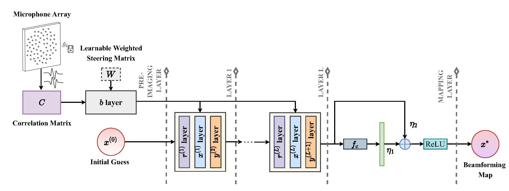

# DAMAS-FISTA-Net

This is the updated user-friendly code for the paper "Learning an Interpretable End-to-End Network for Real-Time Acoustic Beamforming".
- The previous version can be found at https://github.com/JoaquinChou/DAMAS_FISTA_Net. 
- The code for the baseline can be found at https://github.com/HauLiang/Acoustic-Beamforming-Advanced.
  

If you use the code, please cite our paper:
> [Liang, Hao and Zhou, Guanxing and Tu, Xiaotong and Jakobsson, Andreas and Ding, Xinghao and Huang, Yue, "Learning an Interpretable End-to-End Network for Real-Time Acoustic Beamforming", *Journal of Sound and Vibration*, 2024.](https://doi.org/10.1016/j.jsv.2024.118620 "https://doi.org/10.1016/j.jsv.2024.118620")


## Network Architecture

The proposed DAMAS-FISTA-Net is tailored to the acoustic beamforming problem, mainly generalizing the five types of operations to have learnable parameters as network layers, i.e., a pre-imaging layer ($\mathbf{b}$), reconstruction layers ($\mathbf{r}^{(k)}$), nonlinear transform layers ($\mathbf{x}^{(k)}$), momentum layers ($\mathbf{y}^{(k+1)}$), and a mapping layer ($\mathbf{x}^{*}$). Among them, the $\mathbf{r}^{(k)}$ layers, the $\mathbf{x}^{(k)}$ layers, and the $\mathbf{y}^{(k+1)}$ layers are collectively termed the iteration layers forming a fixed depth, $L$. The following figure illustrates the architecture of the proposed DAMAS-FISTA-Net. 

 

This figure illustrates the overall architecture of the proposed DAMAS-FISTA-Net with $L$ iteration layers. As can be seen, this framework mainly consists of five types of modules: pre-imaging ($\mathbf{b}$), reconstruction ($\mathbf{r}^{(k)}$), nonlinear transform ($\mathbf{x}^{(k)}$), momentum ($\mathbf{y}^{(k+1)}$), and mapping ($\mathbf{x}^*$). A correlation matrix, $\mathbf{C}$​, directly obtained from the raw data, may be successively processed, and finally generates a beamforming map. Further details of these layers can be found in our paper.


## Preparation

- Dataset Download:

  The beamforming dataset can be downloaded from the following link:

  https://drive.google.com/drive/folders/1xAaoFPD2PPrx6ceTg0K-SU-gnxlncFqM?usp=drive_link

  This dataset contains 2000 source samples with 1400 points (70%) for training and 600 points (30%) for testing.

- Dataset Setup:

  To train and test the network, one may need to place the downloaded `"data"` and `"label"` flies into the `"dataset"` folder. Also, we have provided an implementation for dataset splitting. Please refer to the `.txt` file in the `"data_split"` folder for details. 


## Training

```shell
python train.py --train_dir ./data_split/One_train.txt --test_dir ./data_split/One_test.txt
```

After training, the trained model will be saved in the `save_models` folder. We also provide a pre-trained model for the DAMAS-FISTA-Net architecture. One may download the model from `./save_models/08-20-23-06/last.pt` to reproduce the results.


## Testing

```shell
python test.py --ckpt ./save_models/08-21-00-56/last.pt --test_dir ./data_split/One_test.txt
```

After testing, the visualization and output results can be found in the `"vis_results"` and `"output_results"` folder, respectively. 


@ All rights are reserved by the authors.
